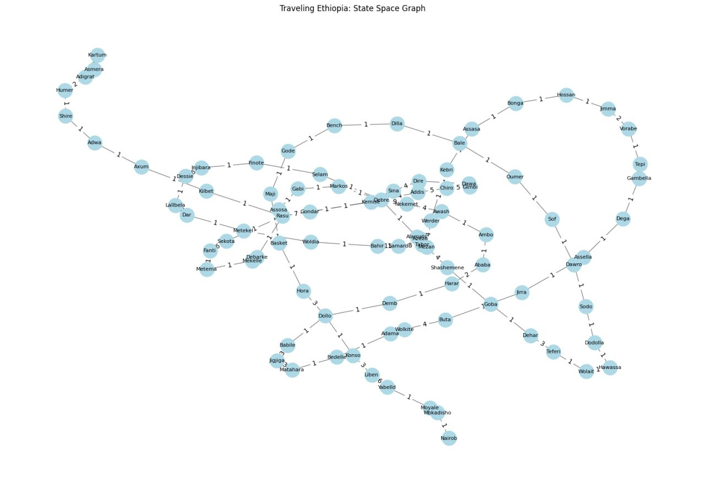

# Ai_work
This project is mainly focused on AI.

## Project Overview
This project is part of an AI assignment at Addis Ababa University (AAU). It explores and implements artificial intelligence concepts and techniques.

## Author
- **Name**: Samuel Tesfaye  
- **ID**: ATE/0561/14

## Usage
This project is intended for educational purposes and demonstrates AI-related tasks and solutions.

## License
This project is licensed under the MIT License.  

## Description
This project delves into various AI methodologies, including machine learning, natural language processing, and computer vision. It aims to provide practical implementations and insights into these areas.

## Documentation
You can view or download the project documentation [click me](./assets/Ai_Ass_Samuel.pdf).
## AI Tree Visualization
Below is an image representing the AI tree built using the Jupyter Notebook:

